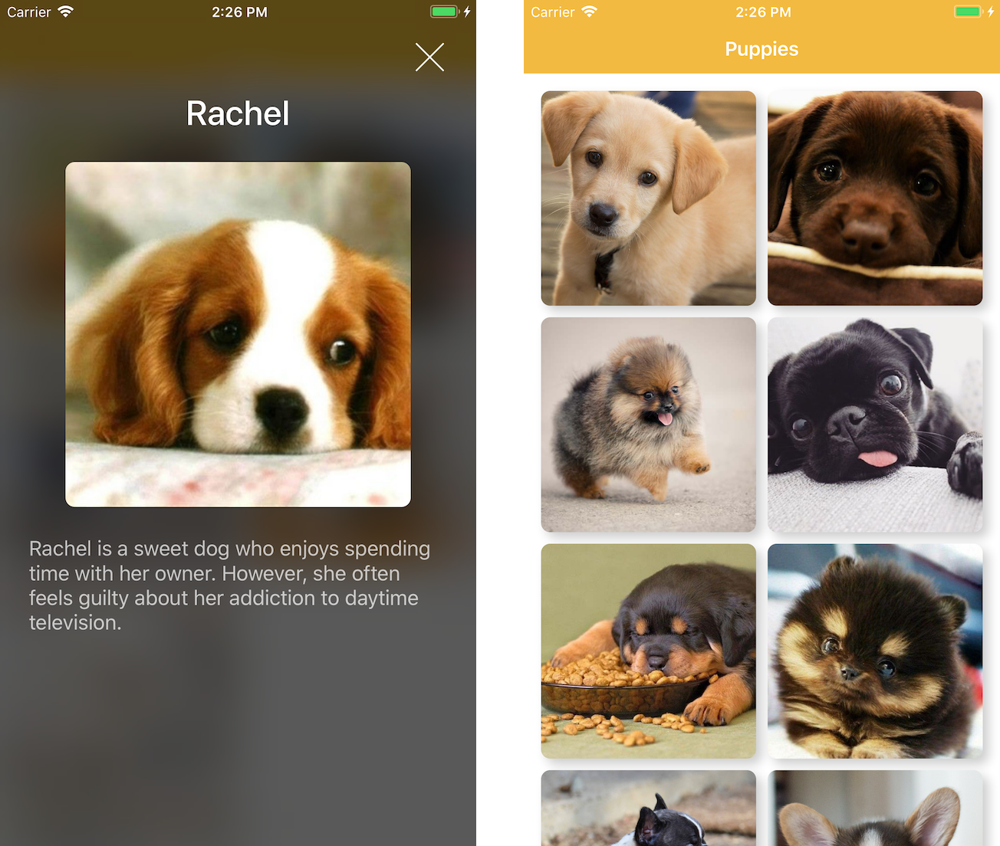

# Animations Demo

This is a demo iPad app that shows how to animate views and transitions on iOS. It includes code samples, live interactions, and explanations for all demonstrated API. Specifically, it demonstrates using one-off, closure-based animations using `UIView`'s `animate(withDuration:animations:completion)`, using iOS 10's `UIViewPropertyAnimator`, and includes a quick demo of iOS's built-in transition animations.

 
  

This repository also includes a 'PuppyViewer' sample app that demonstrates a simple custom `UIViewController` transition animation.

 
  

